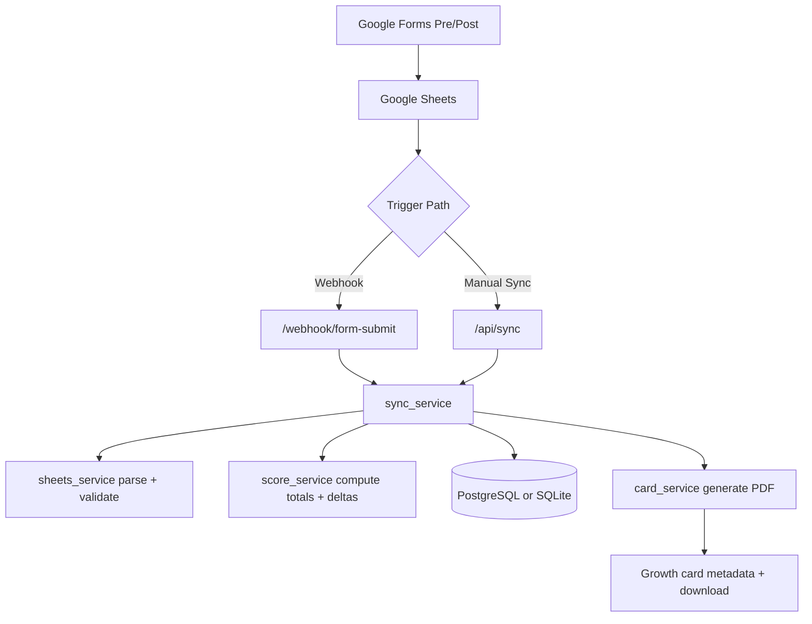
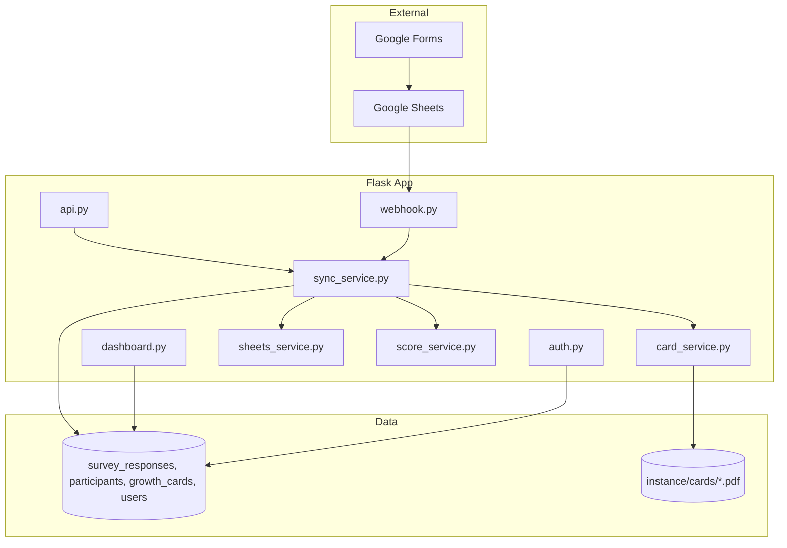

# Slushies Platform

### Survey-to-Insight Pipeline for Youth Programme Outcomes

> **Mission:** Turn pre/post psychometric survey data into actionable growth insights, fast and safely, for programme staff.

---

## The Problem

Programme teams need more than raw form responses. They need:

- reliable pre/post linking without storing direct participant PII
- automatic scoring across multiple frameworks
- immediate feedback artifacts for staff and participants
- operational controls that survive real-world retries, partial submissions, and deployment drift

Traditional process is manual and fragile: spreadsheet exports, ad-hoc formulas, and delayed reporting.

## The Solution

Slushies Platform is a Flask application that ingests Google Form responses from Google Sheets, computes psychometric scores, stores auditable records, and generates participant growth cards.



---

## Core Capabilities

- End-to-end survey pipeline orchestration via sync service
- Four scoring frameworks:
  - ACT SG
  - CMI
  - Rosenberg Self-Esteem
  - Eudaimonic Well-Being
- Role-based auth (admin/staff) with protected dashboard and API routes
- Idempotent row handling via unique sheet row index
- CSV export with delta fields joined from latest growth card
- Production safety guards:
  - strict DATABASE_URL requirement in production
  - webhook secret fail-closed behavior
  - init-db blocked in production
- CI migration gate with PostgreSQL migration smoke checks

---

## Tech Stack

| Layer | Technology | Purpose |
|---|---|---|
| Backend | Flask 3 | Web app + routing |
| ORM | SQLAlchemy + Flask-Migrate/Alembic | Models, schema migration |
| Auth | Flask-Login + Flask-Bcrypt | Session auth + password hashing |
| Rate limiting | Flask-Limiter | Webhook abuse protection |
| Data source | Google Sheets API v4 | Survey row retrieval |
| PDF rendering | WeasyPrint | Growth card generation |
| Database (dev) | SQLite | Local development |
| Database (prod) | PostgreSQL | Production persistence |
| Testing | Pytest | Unit and integration checks |
| CI | GitHub Actions | Tests + migration smoke gate |

---

## Architecture



---

## Project Structure

```text
slushies/
├── platform_app/
│   ├── app/
│   │   ├── routes/         # auth, dashboard, api, webhook
│   │   ├── services/       # sheets, score, sync, card
│   │   ├── templates/
│   │   └── models.py
│   ├── migrations/
│   ├── scripts/
│   │   └── smoke_test.py
│   ├── tests/
│   ├── run.py
│   ├── requirements.txt
│   └── SECURITY_REPORT.md
└── .github/workflows/
    └── ci.yml
```

---

## Getting Started

### 1. Setup

```bash
git clone <your-repo-url>
cd slushies
python -m venv .venv
```

Windows:

```powershell
.\.venv\Scripts\Activate.ps1
```

macOS/Linux:

```bash
source .venv/bin/activate
```

Install dependencies:

```bash
pip install -r platform_app/requirements.txt
```

### 2. Configure environment

Copy and edit:

```bash
cp platform_app/.env.example platform_app/.env
```

Required variables (minimum):

- FLASK_ENV
- SECRET_KEY
- GOOGLE_SHEET_ID
- WEBHOOK_SECRET
- DATABASE_URL (required in production)

For production secret injection, prefer:

- GOOGLE_SERVICE_ACCOUNT_JSON

### 3. Run migrations

```bash
cd platform_app
flask db upgrade
```

### 4. Create admin account

```bash
flask create-admin
```

### 5. Start app

```bash
flask run
```

Open:

- http://127.0.0.1:5000/login

---

## API Overview

### Protected endpoints (login required)

- POST /api/sync
- GET /api/participants
- GET /api/participants/{code}
- PUT /api/participants/{code}
- DELETE /api/participants/{code} (admin)
- GET /api/responses?limit={n}&offset={n}
- GET /api/responses/{id}
- DELETE /api/responses/{id} (admin)
- GET /api/cards/{code}
- GET /api/export/csv (admin)

### Public webhook endpoint

- POST /webhook/form-submit

Expected headers:

- X-Webhook-Secret

---

## Testing

Run full test suite:

```bash
cd platform_app
pytest -q
```

Run migration chain integrity (offline, fast):

```bash
pytest -q tests/test_migration_integrity.py
```

---

## Testing with Real Google Forms Submissions (E2E)

1. Prepare local app runtime:

```bash
cd <project-root>
python -m venv .venv
source .venv/bin/activate
pip install -r platform_app/requirements.txt
cp platform_app/.env.example platform_app/.env
cd platform_app
flask db upgrade
flask create-admin
flask run
```

2. Configure Google Sheets API access:
- Create a Google Cloud service account.
- Enable Google Sheets API for that project.
- Download JSON key and save locally (default: `platform_app/service-account-key.json`) or set `GOOGLE_SERVICE_ACCOUNT_JSON`.
- Share the Google response Sheet with the service account email (Viewer access is enough).

3. Verify sheet column order:
- Keep form response columns aligned with `COL_MAP` in `platform_app/app/services/sheets_service.py`.
- If question order changes, update `COL_MAP` to match.

4. Expose webhook endpoint publicly:
- Deployed app: use your HTTPS app URL.
- Local app: use a tunnel (for example ngrok/cloudflared).
- Endpoint to expose: `POST /webhook/form-submit`.

5. Install Google Apps Script trigger:
- Open the response sheet: **Extensions → Apps Script**.
- Paste `platform_app/scripts/apps_script_trigger.gs`.
- Set `WEBHOOK_URL` to `https://<public-url>/webhook/form-submit`.
- Set `WEBHOOK_SECRET` to exactly match app `WEBHOOK_SECRET`.
- Add trigger: **Triggers → Add Trigger → onFormSubmit → From spreadsheet → On form submit**.

6. Run real submission verification:
- Submit a real Google Form response.
- Check Apps Script execution logs for webhook HTTP result.
- Verify new responses in dashboard/API.
- For a `post` submission with an existing `pre` for the same code, verify growth card generation.

7. Use fallback sync if webhook delivery is missed:
- Authenticated API sync: `POST /api/sync`
- CLI sync:

```bash
cd <project-root>
cd platform_app
flask sync
```

---


## CI and Migration Gate

GitHub Actions workflow in .github/workflows/ci.yml has two jobs:

1. test
- installs dependencies
- runs pytest

2. migration-smoke
- starts PostgreSQL service
- runs flask db upgrade
- verifies required tables and constraints
- verifies database alembic head matches migration head

This prevents schema drift and broken migration chains from merging.

---

## Production Smoke Script

Script location:

- platform_app/scripts/smoke_test.py

It verifies:

- GET /login
- authenticated /dashboard
- POST /api/sync
- GET /api/export/csv
- POST /webhook/form-submit unauthorized behavior

Run:

```bash
cd platform_app
python scripts/smoke_test.py --url https://your-app.example.com --email admin@example.com --password <password>
```

Exit code:

- 0: all checks passed
- 1: one or more checks failed

---

## Security and Privacy

- Participant model stores anonymous code + cohort only
- Passwords hashed with bcrypt
- Webhook secret compared with constant-time compare
- Production blocks empty webhook secret
- Security assessment artifact:
  - platform_app/SECURITY_REPORT.md

---

## Operational Notes

- Use flask db upgrade for schema changes in non-dev environments
- Do not use init-db in production
- Keep Google Sheet column order aligned with sheets_service COL_MAP
- Prefer JSON-based service account secret injection in hosted environments

---

## Roadmap

- richer analytics dashboards and cohort trends
- optional outbound delivery integrations (Drive/email workflows)
- additional evidence and audit tooling around sync outcomes

---

Built for reliable outcomes tracking with strong operational and security guardrails.
